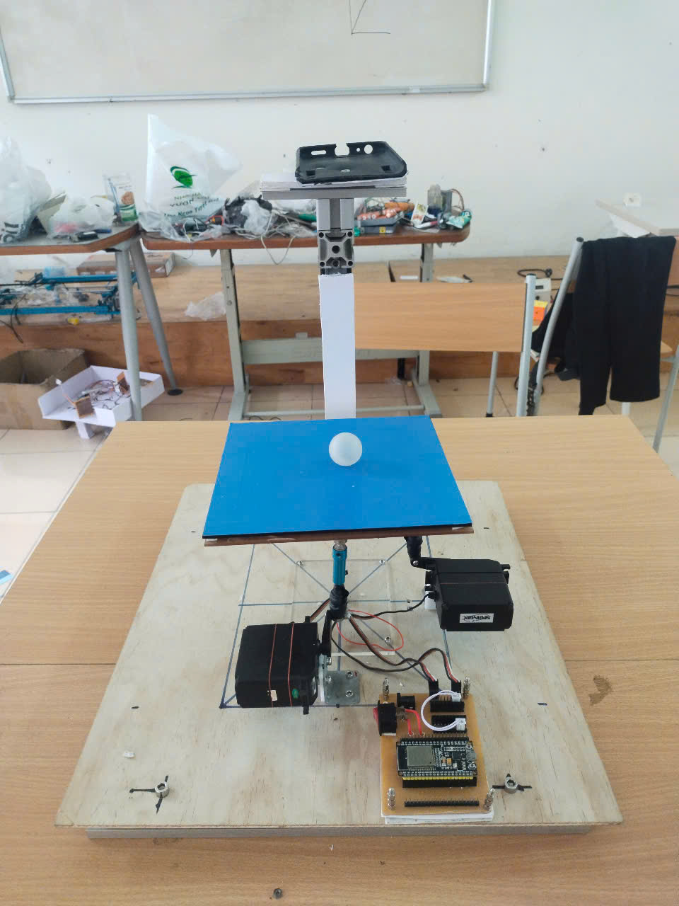
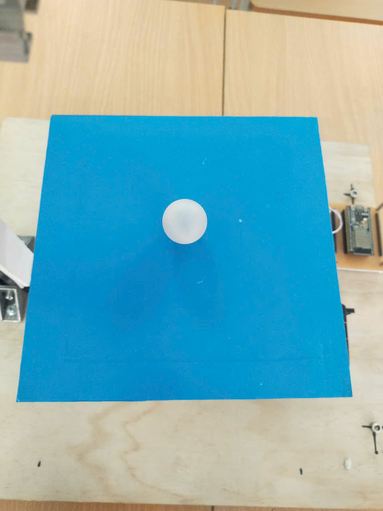

# 🎯 Hệ Thống Cân Bằng Vật Thể Dựa Trên PID 🎯

## 📌 Giới Thiệu
Hệ thống này sử dụng PID (**Proportional-Integral-Derivative**) để cân bằng một vật thể trên mặt phẳng động.
Camera điện thoại thông minh được dùng để theo dõi vị trí vật thể theo thời gian thực, sau đó gửi dữ liệu về vi điều khiển qua **UART** để điều chỉnh động cơ servo.

📷 **Camera → Xử lý hình ảnh → Tính toán lỗi PID → Điều khiển servo**

## 🚀 Tính Năng Chính
✅ Theo dõi vật thể theo thời gian thực bằng **OpenCV**.  
✅ Điều khiển **PID** linh hoạt, giúp hệ thống đạt trạng thái cân bằng nhanh chóng.  
✅ Kết nối với **vi điều khiển** qua **UART** để phản hồi ngay lập tức.  
✅ **PID Tuning "bằng cơm"** – tinh chỉnh từng tham số để đạt hiệu suất tối ưu.  

---

## 🛠️ Yêu Cầu Hệ Thống

### 🔌 Phần Cứng
- **Máy tính chạy Windows 10**. (vì phần mềm phát triển chủ yếu trên window 10)
- **Camera điện thoại thông minh** để theo dõi vật thể (ưu tiên kết nối có dây để giảm độ trễ).
- **Vi điều khiển** (ESP32, Arduino, STM32, ...) kết nối qua **UART**.
- **Động cơ servo** để điều chỉnh mặt phẳng cân bằng.

### 💻 Phần Mềm
Cài đặt các thư viện cần thiết trên **Python**:

```bash
pip install opencv-python numpy matplotlib joblib pyserial
```

---

## 🎮 Cách Sử Dụng

### 1️⃣ Kết nối camera điện thoại với máy tính
Sử dụng **IVCam** (Android) hoặc **DroidCam** để truyền video.

### 2️⃣ Chạy mô hình đã huấn luyện
```python
from joblib import load
model = load("random_forest_model.joblib")
```

### 3️⃣ Mở cổng UART với vi điều khiển
```python
import serial
ser = serial.Serial('COM7', baudrate=115200, timeout=0)
```

### 4️⃣ Chạy chương trình chính
```bash
python main.py
```

### 5️⃣ Điều chỉnh thông số PID bằng phím tắt
| Phím | Chức năng |
|------|-----------|
| W/A/S/D | Di chuyển cửa sổ theo dõi |
| 1-4 | Thay đổi điểm đặt (**setpoint**) |
| F | Bật/tắt khu vực theo dõi |
| Q | Thoát chương trình |

---

## 🎛️ PID Tuning "Bằng Cơm"

Chỉnh **PID** theo cách "cảm nhận" hệ thống từng bước như sau:

🔹 **Bước 1**: Chỉnh **Kp** – tăng dần cho đến khi hệ thống phản hồi nhanh nhưng không dao động mạnh.  
🔹 **Bước 2**: Chỉnh **Kd** – thêm vào để giảm dao động, tránh rung lắc.  
🔹 **Bước 3**: Chỉnh **Ki** – thêm vào nếu có sai số dư, nhưng đừng quá cao kẻo bị trễ.  

🔥 **Tip "Cơm"**: Nếu bị dao động quá mức, tắt một pha (**Kd hoặc Ki**) rồi chỉnh lại từ đầu!

Ví dụ thông số **PID** chuẩn bị chạy:
```python
PID_params = {
    'x': {'kp': 2.5, 'ki': 0.2, 'kd': 45},
    'y': {'kp': 2.5, 'ki': 0.2, 'kd': 45}
}
```

---

## 🔧 Firmware ESP32

### 🔹 Tổng Quan
Firmware chạy trên ESP32 có nhiệm vụ:
- Nhận dữ liệu vị trí của vật thể từ máy tính qua UART.
- Tính toán lỗi và cập nhật góc servo theo thông số PID.
- Điều khiển 2 động cơ servo để duy trì trạng thái cân bằng.

### 🔹 Luồng Hoạt Động
1. Khởi tạo ESP32, gán chân servo và thiết lập Serial.
2. Nhận dữ liệu vị trí bóng từ máy tính qua Serial.
3. Nếu không tìm thấy bóng, đặt giá trị lỗi về -1.
4. Nếu có dữ liệu hợp lệ, cập nhật góc servo theo vị trí mới.
5. Lặp lại chu trình.

### 🔹 Giao Tiếp UART
ESP32 nhận dữ liệu từ máy tính theo định dạng:
```
x_valuex y_value
```
- `x_value` và `y_value` là tọa độ của vật thể.
- Nếu không tìm thấy vật thể, ESP32 nhận chuỗi `"no"`.

### 🔹 Mã Nguồn ESP32
```cpp
#include <Servo.h>
#include <Wire.h>

static const int servoPin1 = 16;
static const int servoPin2 = 17;
Servo servo1, servo2;

float x_error = -1, y_error = -1;
unsigned long previousMillis = 0;

void setup() {
  Serial.begin(115200);
  servo1.attach(servoPin1);
  servo2.attach(servoPin2);
  servo1.write(55);
  servo2.write(55);
}

void loop() {
  unsigned long currentMillis = millis();
  if (currentMillis - previousMillis >= 1) {
    previousMillis = currentMillis;
    processData();
    servo1.write(x_error);
    processData();
    servo2.write(y_error);
  }
}

void processData() {
  if (Serial.available() > 0) {
    String input = Serial.readStringUntil('\n');
    if (input == "no") {
      x_error = -1;
      y_error = -1;
    } else {
      int separatorIndex = input.indexOf('x');
      if (separatorIndex != -1) {
        x_error = input.substring(0, separatorIndex).toInt();
        y_error = input.substring(separatorIndex + 1).toInt();
      }
    }
  }
}
```

### 🔹 Cải Tiến Tương Lai
- **Bổ sung bộ lọc tín hiệu** để giảm nhiễu dữ liệu từ camera.
- **Tối ưu hóa thuật toán PID** để tăng tốc độ phản hồi.
- **Cải thiện giao tiếp Serial** để xử lý dữ liệu nhanh và ổn định hơn.

---

## 📸 Hình Ảnh & Video
📌 Ảnh hệ thống:

  
📌 Video chạy hệ thống
- Cho phép điều chỉnh vị trí cân bằng thông qua bàn phím
- 
- Hiệu suất cân bằng ấn tượng
- 
- Cải tiến thêm - Sẽ cập nhật mã nguồn trong tương lai: cho phép thay đổi vị trí setpoint bằng nhấp chuột
- 
---

## 📜 Giấy Phép
Dự án mã nguồn mở 

